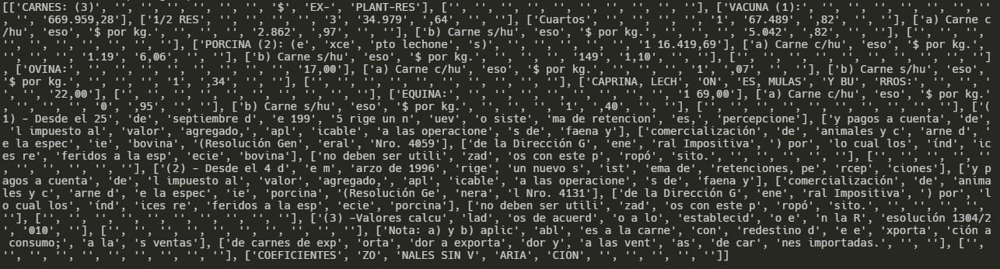

https://github.com/jsvine/pdfplumber?tab=readme-ov-file

```python
import pdfplumber
pdf = pdfplumber.open(archivo)
pagina = pdf.pages[pagina]

#para ver la imagen pura, sin ningun tratamiento 
imagen = pagina.to_image(resolution=300)
imagen.show()
```


    

```python
# depuración visual para ver que tablas reconoce
# las lineas rojas representa las lineas, los circulos azules son las intersecciones enter las lineas
# los pintado de celeste representa las celdas
imagen.debug_tablefinder().show() #si no muestra lineas azules y rojas, no encontro nada
    
# si no encuentra nada puedo empezar a parametrizar la busqueda con table_settings
```


```python
 # parametrizar la deteccion de tablas con plumber
    table_settings = {
        "vertical_strategy": "text", #"lines", "lines_strict", "text", or "explicit"
        "horizontal_strategy": "text", #"lines", "lines_strict", "text", or "explicit"
        "snap_y_tolerance": 5,
        "intersection_x_tolerance": 1,
    }
imagen.reset().debug_tablefinder(table_settings).show()
```


```python
    # ahora extraigo la tabla de acuerdo a table_settings
    tablas = pagina.extract_tables(table_settings)
    for row in tablas[:5]:
        print(row)
    
```




```python
    # imagen.draw_rects(pagina.extract_words()).show()
    # imagen.draw_line(((60, 135), (60, 380)), stroke=(255, 0, 0), stroke_width=10).show()
    # draw_line es para dibujar una linea
    # draw_lines es para dibujar lineas
    # el primer parametro es la coordenada de inicio (x,y) y el segundo la coordenada de fin (x,y)
    # stroke es el color de la linea
    # stroke_width es el ancho de la linea
    
    recorte = imagen.draw_rect((85, 175, 510, 255), stroke=(255, 0, 0), stroke_width=10)
    recorte.show()
    # draw_rect es para dibujar un rectangulo
    # draw_rects es para dibujar rectangulos
    
    
    # draw_circle es para dibujar un circulo
    # draw_circles es para dibujar circulos
```


```python
# con los datos de las coordenadas que queremos recortar, tenemos que trabajar
# con la pagina de pdf, no se puede trabajar con la imagen
pagina_recortada = pagina.within_bbox((85, 175, 510, 255))

#para extraer el texto
text = pagina_recortada.extract_text(keep_blank_chars=True)
print(text)
```


```python
   #EXTRAER PERIODO DE UNA ZONA EN PARTICULAR
  corte = pagina.within_bbox((0, 129, pagina.width, 145))
  corte.to_image().show()
  texto = corte.extract_text()
  print(texto)
```


```python
# para buscar un texto determinado y extraer la fila completa
resultados = []
palabras_buscadas = "") Carne c/hueso"

texto = pagina.extract_text()
# Divide el texto en líneas
lineas = texto.split('\n')
# Recorre cada línea
for i, linea in enumerate(lineas):
  # Si la línea comienza con la palabra especificada
  if linea.startswith(palabras_buscadas):
  # Agrega la línea a la lista de resultados
  resultados.append(linea)
```

