https://github.com/jsvine/pdfplumber?tab=readme-ov-file

### Lectura de archivo pdf y visuzalizacion basica

+ Generar un objeto pdf plumber

+ Generar una imagen desde el objeto pdf con una determianda resolucion

+ Visualizar 

```python
import pdfplumber
archivo = "xxx"
pagina = 2
pdf = pdfplumber.open(archivo)
pagina = pdf.pages[pagina]

#para ver la imagen pura, sin ningun tratamiento 
imagen = pagina.to_image(resolution=300)
imagen.show()
```

**pdfplumber.open()** va a generar un objeto plumber

**objeto_plumber.pages[]** va a extraer de ese objeto una determinada pagina o paginas

**objeto_plumber.to_image()** va a generar una imagen para que se pueda visualizar desde un objeto plumber

**imagen.show()** va a mostrar una imagen


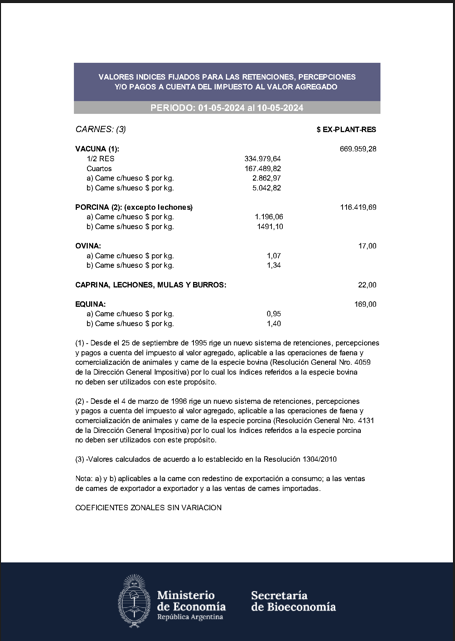

### Reconociendo alguna tabla en la imagen

+ lineas rojas: representa las lineas de la tabla que ha encontrado automaticamente plumber

+ circulos azules: representa la interseccion entre las lineas verticales y  horizontales

+ celdas azules: representa la celda que ha reconocido   

En el caso que no se muestren lineas rojas, circulos y/o celdas, es porque Plumber no ha reconocido ninguna tabla por lo que hay que empezar a parametrizar lo que necesitamos y esto se hace con un diccionario que vamos a llamar table_settings

```python
imagen.debug_tablefinder().show()
```

**imagen.debug_tablefinder()** va a buscar tablas en una imagen

Los valores por defecto de table_settings son los siquientes:

```python

table_settings = {
    "vertical_strategy": "lines", 
    "horizontal_strategy": "lines",
    "explicit_vertical_lines": [],
    "explicit_horizontal_lines": [],
    "snap_tolerance": 3,
    "snap_x_tolerance": 3,
    "snap_y_tolerance": 3,
    "join_tolerance": 3,
    "join_x_tolerance": 3,
    "join_y_tolerance": 3,
    "edge_min_length": 3,
    "min_words_vertical": 3,
    "min_words_horizontal": 1,
    "intersection_tolerance": 3,
    "intersection_x_tolerance": 3,
    "intersection_y_tolerance": 3,
    "text_tolerance": 3,
    "text_x_tolerance": 3,
    "text_y_tolerance": 3,
    "text_*": …, # See below
}
```


No necesariamente se deben usar todas las claves valor del diccionario

```python
 # parametrizar la deteccion de tablas con plumber
    table_settings = {
        "vertical_strategy": "text", #"lines", "lines_strict", "text", or "explicit"
        "horizontal_strategy": "text", #"lines", "lines_strict", "text", or "explicit"
        "snap_y_tolerance": 5,
        "intersection_x_tolerance": 1,
    }
imagen.reset().debug_tablefinder(table_settings).show()
```

**imagen.reset()**  borra todo tipo de valores por defecto de una imagen

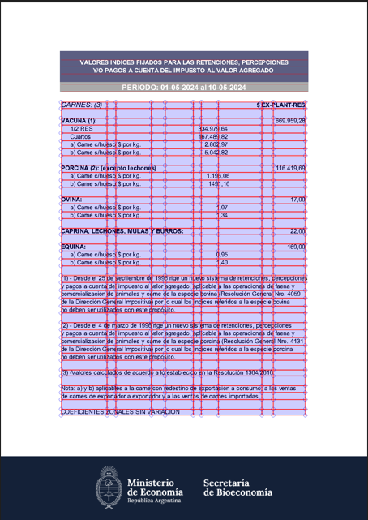


El table_settings se puede usar como parametro tanto en: 

+ imagen.debug_tablefinder( table_settings )  -> para ver que es lo que encuentra

+  page.extact_table ( table_settings )  -> para extraer lo que ha encontrado, va a devolver una lista donde cada fila sera tambien una lista


```python
# ahora extraigo la tabla y luego las otras tablas de acuerdo a table_settings
tablas = pagina.extract_tables(table_settings)
contador = 0

for row in tablas:
    for item in row:
        print(item)
        contador += 1
    
print("cantidad de filas dentro de la lista:" contador )
```

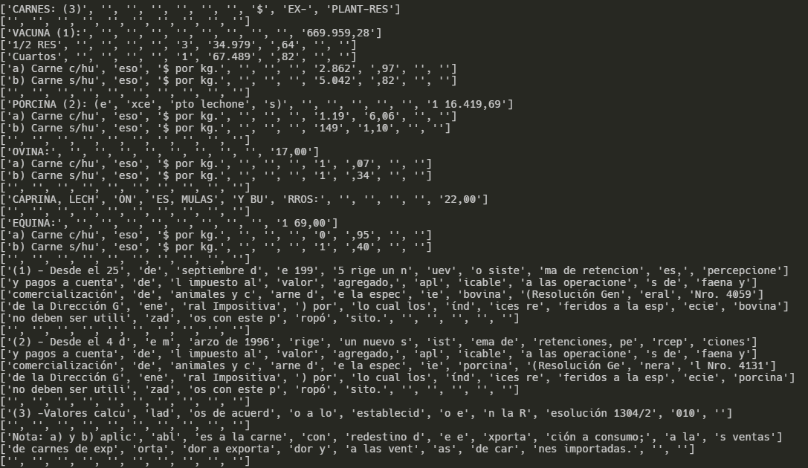

Como se puede observar, esta lista, tiene mas listas dentro, que cada una es un renglon de la imagen que encontro plumber, coincide exactamente, por lo que es necesario poder explicitar correctamente la tabla para luego hacer una extaccion de los datos


### Definir una tabla en un lugar especifico de una imagen

Se puede especificar un determinado lugar de una imagen para forzar a plumber a reconocer una imagen, pasando coordenadas. Es posible definir rectangulo/s, circulo/s y linea/s

* imagen.draw_line(line, stroke={color}, stroke_width=1) :
  
  * line = ( (60, 135), (60, 380) ) # desde (x,y) a (m,n) es el dibujo de la linea
  
  * stroke=(255, 0, 0) # color
  
  * stroke_width=1 # grosor de la linea


```python
imagen.draw_line(((60, 135), (60, 380)), stroke=(255, 0, 0), stroke_width=10).show()
```

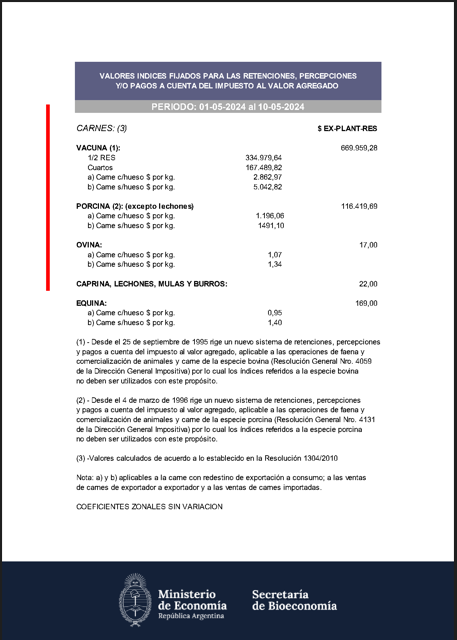

```python
imagen.draw_line(((60, 135), (120, 380)), stroke=(255, 0, 0), stroke_width=10).show()
```

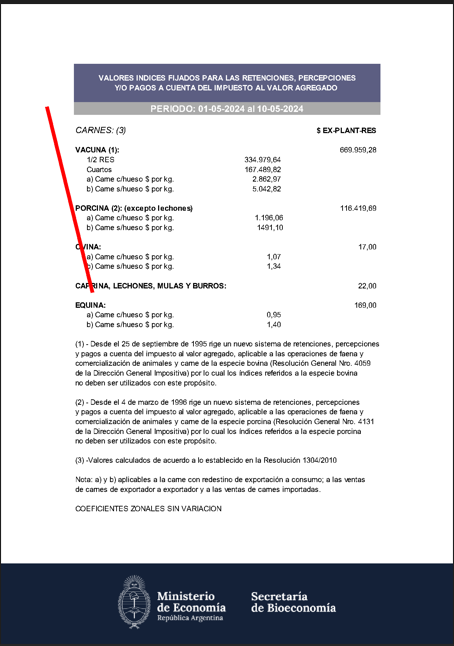

* imagen.draw_rect(bbox_or_obj, fill={color}, stroke={color}, stroke_width=1)
  
  * bbox_or_ob : son las coordenadas del rectangulo
  
  * fill={color} # color
  
  * stroke_width=1 # grosor de la linea


```python
imagen.draw_rect((85, 175, 510, 255), stroke=(255, 0, 0), stroke_width=10).show()
```

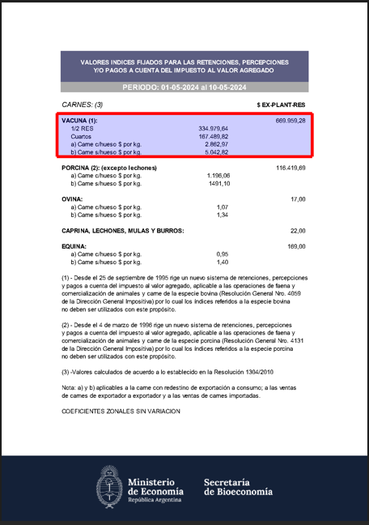

Observar que se la linea roja, tiene dentro la celda pintada de celeste, por lo que plumber ya reconoce como una celda. Se podria pintar mas lineas dentro del rectangulo, para establecer las columnas y filas

Tambien existen: 

+ imagen.draw_circle(center_or_obj, radius=5, fill={color}, stroke={color}) # para circulos

+ im.draw_hline(location, stroke={color}, stroke_width=1)  # para lineas horizontales

+ im.draw_vline(location, stroke={color}, stroke_width=1) # para lineas verticales en una determinada x

+ etc


### Recortar una tabla de una pagina

Es posible cortar una tabla que esta incorporada dentro de una hoja pagina plumber. Para esto vamos a usar las coordenadas anteriores


```python
recorte = pagina.within_bbox((85, 175, 510, 255))
imagen1 = recorte.to_image().show()
```

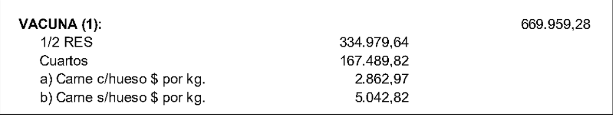


Ahora una explicacion de la parametrizacion de table_settings:

table_settings = {

* "vertical_strategy": "lines",  # Define la estrategia para encontrar líneas verticales que separan las columnas: `"lines"`: Utiliza líneas dibujadas en el PDF

* "horizontal_strategy": "lines", # Define la estrategia para encontrar líneas horizontales que separan las filas. `lines"`: Utiliza líneas dibujadas en el PDF.

*  "explicit_vertical_lines": [], # Lista de posiciones x específicas para considerar como líneas verticales. Se deja vacío para que `pdfplumber` detecte automáticamente.

*  "explicit_horizontal_lines": [], # Lista de posiciones y específicas para considerar como líneas horizontales. Se deja vacío para que `pdfplumber` detecte automáticamente.

*  "snap_tolerance": 3, # Tolerancia general para ajustar las posiciones de las líneas detectadas a las líneas de la tabla.

*  "snap_x_tolerance": 3, # Tolerancia específica para ajustar las posiciones en el eje x

* "snap_y_tolerance": 3, # Tolerancia específica para ajustar las posiciones en el eje y.

*  "join_tolerance": 3, # Tolerancia general para unir fragmentos de líneas en líneas completas.

* "join_x_tolerance": 3, # Tolerancia específica para unir fragmentos de líneas en el eje x.

*  "join_y_tolerance": 3, # Tolerancia específica para unir fragmentos de líneas en el eje y.

*  "edge_min_length": 5, # Longitud mínima que debe tener una línea para ser considerada un borde de celda

*  "min_words_vertical": 2, # define el número mínimo de palabras necesarias en una columna para considerar que hay una línea vertical separando celda. Un valor de 2 significa que se debe detectar al menos dos palabras verticalmente alineadas para que `pdfplumber` considere que hay una línea vertica.

*  "min_words_horizontal": 1, # define el número mínimo de palabras necesarias en una fila para considerar que hay una línea horizontal separando celdas. Un valor de 1 significa que se debe detectar al menos una palabra horizontalmente alineada para que `pdfplumber` considere que hay una línea horizontal

*  "intersection_tolerance": 3, # Define la tolerancia general para considerar que dos líneas (una vertical y una horizontal) se intersectan y forman una esquina de celda. Un valor de 3 significa que si las líneas vertical y horizontal están a 3 unidades de medida o menos de distancia en su punto de intersección, se considerará que se intersectan. Asegura que las celdas se detecten correctamente incluso si las líneas que las forman no están perfectamente alineadas

*  "intersection_x_tolerance": 3, # Define la tolerancia específica en el eje x para considerar la intersección de dos líneas. Un valor de 3 significa que si las líneas están a 3 unidades de medida o menos en el eje x en su punto de intersección, se considerará que se intersectan. Permite ajustes finos para la intersección en la dirección horizontal

*  "intersection_y_tolerance": 3, # Define la tolerancia específica en el eje y para considerar la intersección de dos líneas. Un valor de 3 significa que si las líneas están a 3 unidades de medida o menos en el eje y en su punto de intersección, se considerará que se intersectan. Permite ajustes finos para la intersección en la dirección vertical.

*  "text_tolerance": 2, # Define la tolerancia general para considerar que el texto está alineado dentro de una celda. Un valor de 2 significa que si el texto está a 2 unidades de medida o menos de las líneas de la celda, se considerará que el texto pertenece a esa celda. Ayuda a asegurar que el texto se asocie correctamente con la celda a la que pertenece, incluso si está ligeramente desfasado

*  "text_x_tolerance": 2, # Define la tolerancia específica en el eje x para considerar la alineación del texto dentro de una celda. Un valor de 2 significa que si el texto está a 2 unidades de medida o menos de las líneas de la celda en el eje x, se considerará que el texto pertenece a esa celda. Permite ajustes finos para la alineación del texto en la dirección horizontal.

*  "text_y_tolerance": 2, # Define la tolerancia específica en el eje y para considerar la alineación del texto dentro de una celda. Un valor de 2 significa que si el texto está a 2 unidades de medida o menos de las líneas de la celda en el eje y, se considerará que el texto pertenece a esa celda. Permite ajustes finos para la alineación del texto en la dirección vertical. 
   "snap_x_tolerance": 2, # Ajusta las líneas detectadas para que se alineen correctamente si están dentro de una tolerancia específica. Ajusta las líneas en el eje x. Ayuda a alinear las líneas detectadas que están ligeramente desfasadas, asegurando que las columnas de la tabla estén rectas y bien definida

*  "snap_y_tolerance": 2, # Ajusta las líneas detectadas para que se alineen correctamente si están dentro de una tolerancia específica. Ajusta las líneas en el eje y. Ayuda a alinear las líneas detectadas que están ligeramente desfasadas, asegurando que las filas de la tabla estén rectas y bien definida

*  "join_x_tolerance": 2, # Une fragmentos de líneas que están cerca entre sí para formar líneas continuas.  Ayuda a conectar fragmentos de líneas horizontales que deberían ser una sola línea pero están ligeramente separados, mejorando la detección de las filas

*  "join_y_tolerance": 2, # Une fragmentos de líneas que están cerca entre sí para formar líneas continuas. Ayuda a conectar fragmentos de líneas verticales que deberían ser una sola línea pero están ligeramente separados, mejorando la detección de las columnas
  }


```python
 table_settings = {

    "vertical_strategy": "explicit",

    "horizontal_strategy": "explicit",

    "explicit_vertical_lines": [90, 300, 380, 500],

    "explicit_horizontal_lines": [180,198,212, 250],

}
 
recorte = pagina.within_bbox((85, 175, 510, 255))
 
recorte = recorte.to_image(resolution=200)
 
recorte.reset().debug_tablefinder(table_settings).show()
```


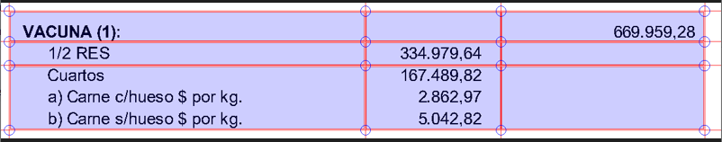


```python
    # imagen.draw_rects(pagina.extract_words()).show()
    # imagen.draw_line(((60, 135), (60, 380)), stroke=(255, 0, 0), stroke_width=10).show()
    # draw_line es para dibujar una linea
    # draw_lines es para dibujar lineas
    # el primer parametro es la coordenada de inicio (x,y) y el segundo la coordenada de fin (x,y)
    # stroke es el color de la linea
    # stroke_width es el ancho de la linea

    recorte = imagen.draw_rect((85, 175, 510, 255), stroke=(255, 0, 0), stroke_width=10)
    recorte.show()
    # draw_rect es para dibujar un rectangulo
    # draw_rects es para dibujar rectangulos


    # draw_circle es para dibujar un circulo
    # draw_circles es para dibujar circulos
```

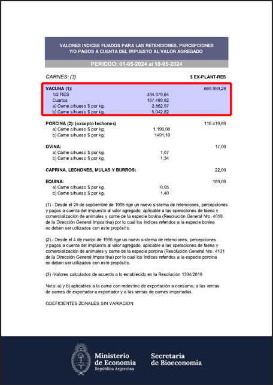

```python
# con los datos de las coordenadas que queremos recortar, tenemos que trabajar
# con la pagina de pdf, no se puede trabajar con la imagen
pagina_recortada = pagina.within_bbox((85, 175, 510, 255))

#para extraer el texto
text = pagina_recortada.extract_text(keep_blank_chars=True)
print(text)
```

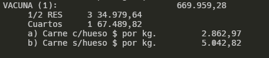

```python
   #EXTRAER PERIODO DE UNA ZONA EN PARTICULAR
  corte = pagina.within_bbox((0, 129, pagina.width, 145))
  corte.to_image().show()
  texto = corte.extract_text()
  print(texto)
```

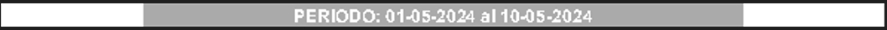

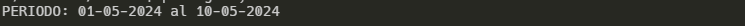

```python
# para buscar un texto determinado y extraer la fila completa
resultados = []
palabras_buscadas = "") Carne c/hueso"

texto = pagina.extract_text()
# Divide el texto en líneas
lineas = texto.split('\n')
# Recorre cada línea
for i, linea in enumerate(lineas):
  # Si la línea comienza con la palabra especificada
  if linea.startswith(palabras_buscadas):
  # Agrega la línea a la lista de resultados
  resultados.append(linea)
```

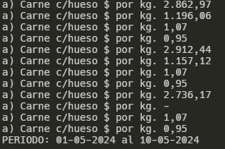